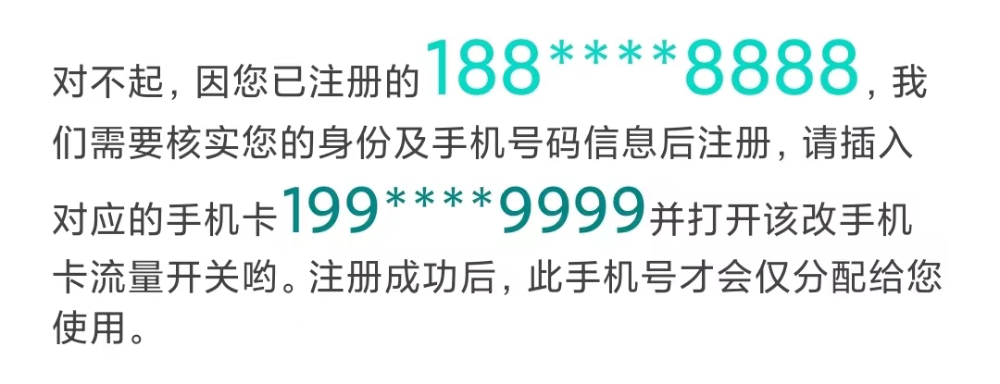
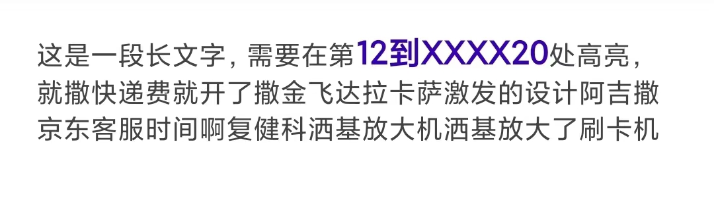
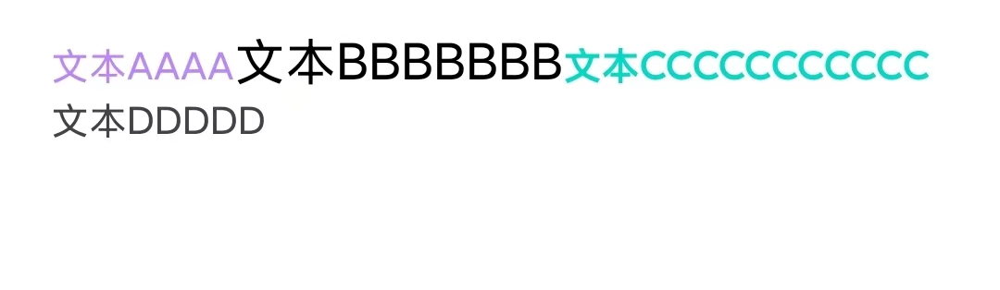

# Android Span 工具
在 Android 项目中，如果想要对一段长文本添加布局点击事件、局部文字变色、加粗等功能，需要通过`Spannable`来实现。但现有框架中，`Spannable`使用相对复杂，使用过程中存在大量的模板代码。


`Spans`框架针对上述痛点，封装了常用的`Span`，使用起来更加方便。


## 支持功能

### 一、占位符替换

在很多场景中，我们只需要对一长段长文本的其中某一小部分进行高亮处理，使用传统的`SpannableString`，代码将会非常难看。

`Spans`框架支持使用占位符`{##}`的方式来替换可变文本，如下：

```shell
"对不起，因您已注册的{$}，我们需要核实您的身份及手机号码信息后注册，请插入对应的手机卡{$}并打开该改手机卡流量开关哟。注册成功后，此手机号才会仅分配给您使用。"
```

两个占位符中的文本都可变的，且我们需要分别在两个占位符处设置点击事件，且颜色高亮，借助该框架，使用如下代码即可轻松完成：

```kotlin
val msg = "对不起，因您已注册的{$}，我们需要核实您的身份及手机号码信息后注册，请插入对应的手机卡{$}并打开该改手机卡流量开关哟。注册成功后，此手机号才会仅分配给您使用。"

Spans.placeholder(msg)
  .color("188****8888", getColor(R.color.teal_200))
  .size(dpToPx(this, 30))
  .click {
    Log.i(TAG, "click A ~~~")
  }
  .color("199****9999", getColor(R.color.teal_700))
  .click {
    Log.i(TAG, "click B B !!!")
  }
  .size(dpToPx(this, 25))
  .inject(tvMsg)
```

最终效果如下：




### 二、索引替换

某些时候，我们只需要对一段文字的某一个区间的文本进行高亮、加粗等处理，`Spans`框架也能轻松应对。

效果：



源代码：

```kotlin
val msg = "这是一段长文字，需要在第12到XXXX20处高亮，就撒快递费就开了撒金飞达拉卡萨激发的设计阿吉撒京东客服时间啊复健科洒基放大机洒基放大了刷卡机"

Spans.indexer(msg)
  .color(getColor(R.color.purple_700), 12, 21) // [12,21)，含头不含尾
  .bold(12, 21)
  .size(dpToPx(this, 18), 12, 21)
  .inject(tvMsg)
```


### 三、流水线替换

当然，有的时候文本分成了很多段，每一段都不确定，`Spans`针对这种场景，提供了流水线形式的替换方式。

```shell
文本AAAA
文本BBBBBBB
文本CCCCCCCCCCC
文本DDDDD
```

最终呈现效果如下：



源代码：

```kotlin
val msg1 = "文本AAAA"
val msg2 = "文本BBBBBBB"
val msg3 = "文本CCCCCCCCCCC"
val msg4 = "文本DDDDD"

Spans.pipeline()
  .color(msg1, getColor(R.color.purple_200))
  .click {
    Log.d(TAG, "click AAA")
  }
  .color(msg2, getColor(R.color.black))
  .click {
    Log.d(TAG, "click BBB")
  }
  .size(dpToPx(this, 20))
  .color(msg3, getColor(R.color.teal_200))
  .bold()
  .click(msg4) {
    Log.d(TAG, "click DDD")
  }
  .inject(tvMsg)
```

