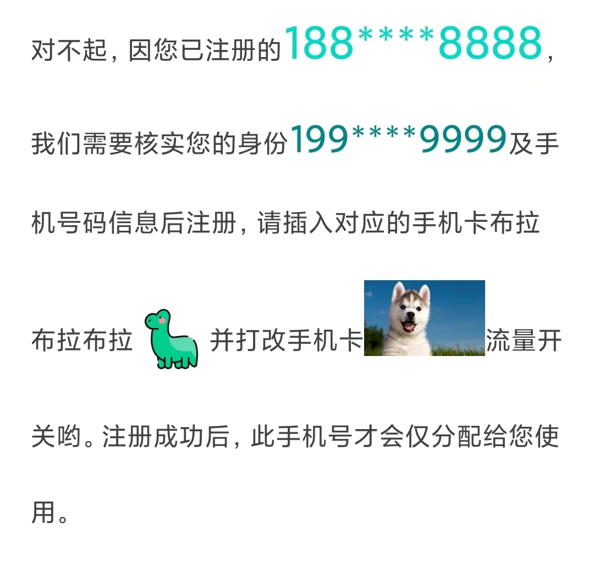
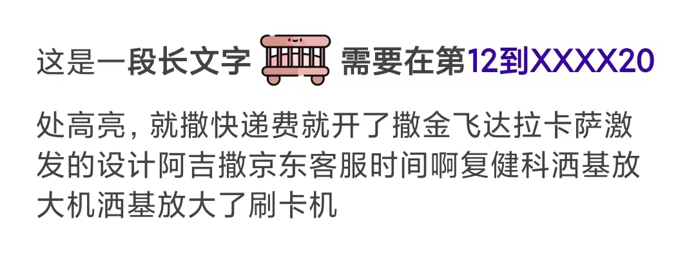

# Spans
在 Android 项目中，将一段普通的文本转换为富文本，需要通过`Spannable#setSpan`来实现。但现有框架中，Span 的使用相对复杂，使用过程中存在大量的模板代码。


`Spans`框架针对上述痛点，封装了常用的`Span`，可方便快速的完成文本中的某一段子文本的颜色、大小、点击事件、加粗等配置，剩下的就交给`Spans` 去实现。


`Spans`也支持在文本中添加图片，不管是本地图片还是网络图片，只要配置好了，底层就会自动去加载。当然，针对网络图片，需要您自己去实现一个图片加载器`SpanImageLoader`，并将加载结果给到`Spans`框架，`Spans`便可以在网络图片加载完成后自动将图片添加到指定位置。具体可以参考示例`GlideImageLoader`。

```kotlin
class GlideImageLoader : SpanImageLoader {

  // 实现加载图片的逻辑
  override fun load(url: String?, callback: SpanImageLoader.Callback) {
    Glide.with(appContext)
      .asDrawable()
      .placeholder(R.drawable.mini_icon4)
      .load(url)
      .into(object : SimpleTarget<Drawable>() {
        override fun onResourceReady(resource: Drawable, transition: Transition<in Drawable>?) {
          // 图片加载完成后告知框架
          callback.onSuccess(resource)
        }

        override fun onLoadStarted(placeholder: Drawable?) {
          super.onLoadStarted(placeholder)
          if (placeholder != null) {
            callback.onSuccess(placeholder)
          }
        }
      })
  }
}
```


如果您对图片的居中方式有要求，`Spans`提供了3种对齐方式供您选择：`BASELINE`、`BOTTOM`、`CENTER`。

- BASELINE：图片的baseline和文字的baseline对齐。图片的baseline是基于文字的baseline模拟的。
- BOTTOM：图片的底部与文字的底部对齐。
- CENTER：图片的中心和文字的中心对齐，图片居中。

这三种对齐方式也都适配的行高，可以放心使用。


## 使用方法

在 `build.gradle`  中添加：

```groovy
implementation 'io.github.chentao7v:spans:1.0.2'
```


## 支持的富文本配置

### 文字

```kotlin
Configs.text()
	.color(color) // 颜色
	.size(textSize) // 大小
	.click { clickEvent... } // 点击事件
	.bold() // 加粗
```

### 图片

```kotlin
Configs.image()
	.drawable(drawable) // 本地图片
	.bitmap(bitmap) // 本地图片
	.url(imageUrl) // 网络图片
	.verticalAlign(verticalAlign) // 对齐方式
	.width(width) // 图片宽度
```


## 替换方式

针对项目中常见的场景，`Spans`提供了3种普通的替换方式

- 占位符替换 -> `PlaceholderFlow`
- 索引替换 -> `IndexerFlow`
- 文本拼接替换 -> `PipelineFlow`


### 一、占位符替换

在很多场景中，我们只需要对一长段长文本的其中某一小部分进行高亮处理，使用传统的`SpannableString`，代码将会非常难看。

`Spans`框架支持使用占位符`{$}`的方式来替换可变文本，如下：

```shell
"对不起，因您已注册的{$}，我们需要核实您的身份及手机号码信息后注册，请插入对应的手机卡{$}并打开该改手机卡流量开关哟。注册成功后，此手机号才会仅分配给您使用。"
```

两个占位符中的文本都可变的，且我们需要分别在两个占位符处设置点击事件，且颜色高亮，借助该框架，使用如下代码即可轻松完成：

```kotlin
val msg = "对不起，因您已注册的{$}，我们需要核实您的身份{$}及手机号码信息后注册，请插入对应的手机卡{$}并打开该改手机卡{$}流量开关哟。注册成功后，此手机号才会仅分配给您使用。"


Spans.placeholder(msg)
	// 使用指定的富文本替换第0个占位符
	.with("188****8888",
    // 符文布对应配置
	  Configs.text()
	    .color(colorRes(R.color.teal_200))
	    .size(30.dp)
	    .click {
	      Log.i(TAG, "click A ~~~")
	    })
	// 使用指定的富文本替换第1个占位符
	.with("199****9999",
	  Configs.text()
	    .color(colorRes(R.color.teal_700))
	    .size(25.dp)
	    .click {
	      Log.i(TAG, "click B B !!!")
	    })
	// 使用图片替换第2个占位符
	.withImage(
	  Configs.image()
	    .drawable(drawableRes(R.drawable.mini_icon5))
	    .verticalAlign(CENTER)
	    .width(50.dp)
	)
	// 使用图片替换第3个占位符
	.withImage(
    // 图片对应配置
	  Configs.image()
	    .url(IMAGE_URL)
	    .verticalAlign(BOTTOM)
	    .width(80.dp)
	    .click {
	      Log.d(TAG, "哈哈哈哈哈")
	    }
	)
	// 指定图片加载器
	.loader(GlideImageLoader())
	.into(tvMsg)
```

最终效果如下：




### 二、索引替换

某些时候，我们只需要对一段文字的某一个区间的文本进行高亮、加粗等处理，`Spans`框架也能轻松应对。

效果：



源代码：

```kotlin
val msg = "这是一段长文字，需要在第12到XXXX20处高亮，就撒快递费就开了撒金飞达拉卡萨激发的设计阿吉撒京东客服时间啊复健科洒基放大机洒基放大了刷卡机"

Spans.indexer(msg)
  .add(12, 21, Configs.text().color(colorRes(R.color.purple_700)))
  .add(3, 21, Configs.text().bold())
  .add(4, 21, Configs.text().size(18.dp))
  .add(7, 30, Configs.text().click {
    Toast.makeText(this, "哈哈哈哈", Toast.LENGTH_SHORT).show()
  })
  .addImage(7, Configs.image().drawable(drawableRes(R.drawable.mini_icon3)).width(50.dp))
  .into(tvMsg)
```


### 三、流水线替换

当然，有的时候文本分成了很多段，每一段都不确定，`Spans`针对这种场景，提供了流水线形式的替换方式。

```shell
文本AAAA
文本BBBBBBB
文本CCCCCCCCCCC
文本DDDDD
```

最终呈现效果如下：


源代码：

```kotlin
val msg1 = "文本AAAA\n"
val msg2 = "文本BBBBBBB\n"
val msg3 = "文本CCCCCCCCCCC\n"
val msg4 = "文本DDDDD"

Spans.pipeline()
  .add(msg1, Configs.text().color(colorRes(R.color.purple_200)).click {
    Log.d(TAG, "click AAA")
  })
  .add(msg2, Configs.text().color(colorRes(R.color.black)).size(20.dp).click { Log.d(TAG, "click BBB") })
  .add(msg3, Configs.text().color(colorRes(R.color.teal_200)).bold())
  .addImage(Configs.image().drawable(drawableRes(R.drawable.mini_icon6))) // 添加图片
  .add(msg4, Configs.text().color(colorRes(R.color.teal_700)))
  .into(tvMsg)
```

